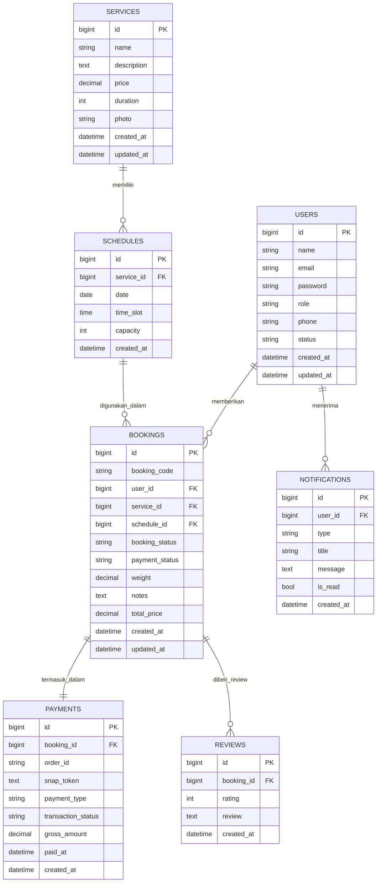

# ERD Booking Service

Berikut ERD yang mengikuti bentuk referensi gambar, tetapi disesuaikan dengan struktur migration yang benar-benar dipakai di aplikasi.

## Makna Relasi

- `Users` memberikan `Bookings`
- `Services` memiliki `Schedules`
- `Schedules` digunakan dalam `Bookings`
- `Bookings` termasuk dalam `Payments`
- `Bookings` diberi `Reviews`
- `Users` menerima `Notifications`

## Catatan Desain

- Diagram ini sengaja dibuat mendekati tampilan ERD referensi yang Anda kirim.
- Nama atribut mengikuti migration supaya dokumentasi, model, dan database tetap konsisten.
- Jika Anda mau, saya bisa lanjut ubah ini menjadi file `.drawio` agar tampilannya benar-benar sama seperti gambar referensi.
