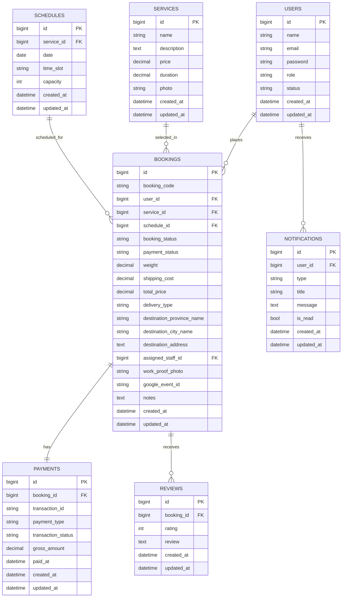

# ERD Booking Service

Berikut ERD logis untuk domain utama aplikasi.

## Relasi Inti

- `users` ke `bookings` adalah one-to-many
- `services` ke `bookings` adalah one-to-many
- `schedules` ke `bookings` adalah one-to-many
- `bookings` ke `payments` umumnya one-to-one
- `bookings` ke `reviews` adalah one-to-many secara teknis, tetapi bisnisnya satu review per booking
- `users` ke `notifications` adalah one-to-many

## Catatan Desain

- `booking_status` dan `payment_status` dipakai sebagai state utama operasional
- `assigned_staff_id` menyimpan staff yang menangani booking
- `google_event_id` digunakan saat booking disinkronkan ke Google Calendar
- Field destinasi disiapkan untuk alur delivery/pickup dan integrasi ongkir
